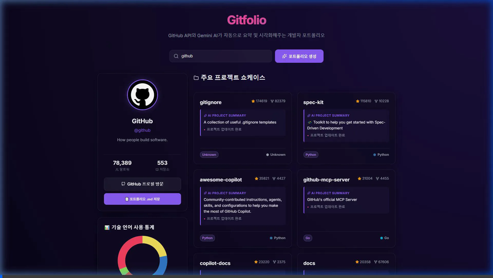
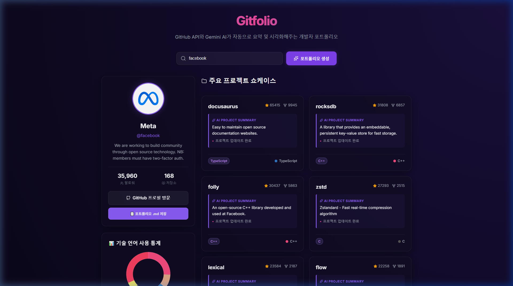

# Walkthrough - Gitfolio (vibeCoding-day25-github-portfolio)

GitHub API와 Gemini API를 통합하여, 사용자가 아이디 입력 한 번으로 자신의 프로필, 사용 언어 비율, 주요 저장소 README 내용의 인공지능 요약을 포함하는 고품격 개발자 포트폴리오를 만들어내는 웹 애플리케이션의 개발을 무사히 마쳤습니다! 🎉

이번 업데이트에서는 포트폴리오 정보를 **마크다운(.md) 파일로 로컬에 편리하게 저장**하는 기능이 새롭게 구현되었습니다.

---

## 🛠️ 주요 구현 내용

1. **Express 백엔드 중계 서버 (`server.js`)**
   - **방문자 카운터**: 파일 기반(`visitors.json`)으로 방문자 수가 누적 카운트되어 유지됩니다.
   - **GitHub & Gemini 통합 API**: 유저 정보와 리포지토리를 불러온 후, 각 저장소의 README 내용을 `gemini-1.5-flash` 모델을 통해 핵심 기술스택, 한줄 요약, 주요 업데이트 특징으로 정밀하게 정돈하여 한국어 JSON 구조로 자동 요약합니다.
   
2. **React + Vite 프론트엔드 UI & 기능**
   - **포트폴리오 마크다운(.md) 내보내기**:
     - 생성된 포트폴리오의 전체 프로필, 사용 언어 및 리포지토리별 AI 요약 정보를 포함하는 고유한 마크다운 문서 내용을 동적으로 생성합니다.
     - **브라우저 호환성 다운로드**: Chrome 86+ 이상 환경에서 안전하게 작동하도록 `window.showSaveFilePicker` API를 최우선으로 사용하여 "다른 이름으로 저장" 대화 상자를 제공합니다.
     - `showSaveFilePicker` 미지원 환경의 경우 Blob URL 방식을 제공하되, 다운로드 완료 전 파일 해제 현상을 방지하기 위해 `URL.revokeObjectURL`을 즉시 실행하지 않고 40초 지연하여 정리하도록 보장하였습니다.
   - **글래스모피즘 & 네온 다크 테마**: 세련되고 미려한 색감의 배경 그라데이션과 블러 처리된 카드 디자인을 적용하여 프리미엄 비주얼을 완성했습니다.
   - **기술 통계 시각화 (`LanguageChart.jsx`)**: `chart.js` 및 `react-chartjs-2`를 이용하여 각 저장소의 사용 언어를 취합하고, 가독성 높은 도넛 차트로 실시간 시각화합니다.
   - **실시간 자동 새로고침**: 포트폴리오를 연 뒤 '자동 새로고침'을 켜두면, 60초 타이머가 작동하여 실시간으로 데이터가 백엔드에서 갱신됩니다.
   - **스켈레톤 로딩**: 데이터를 받아오는 동안 매끄러운 움직임의 스켈레톤 UI를 보여줍니다.

---

## 🎥 검증 및 확인 결과

브라우저 서브에이전트를 통하여 로컬 개발 환경(`http://localhost:5173`)에 접속한 뒤 `facebook` 계정으로 포트폴리오를 생성하고, 새롭게 추가된 마크다운 내보내기 기능의 비주얼과 정상 작동 여부를 성공적으로 검증하였습니다.

### 1. 마크다운 저장 기능 동작 검증 (비디오)

### 2. 마크다운 내보내기 버튼이 포함된 완성 화면 (스크린샷)

---

## 📁 생성/수정된 파일 목록

- [server.js](file:///e:/AI_DEV/AIBook/VibeCodingAcorn/vibeCoding-day25-github-portfolio/server.js): Express 중계 및 Gemini API 요약 백엔드 코드
- [vite.config.js](file:///e:/AI_DEV/AIBook/VibeCodingAcorn/vibeCoding-day25-github-portfolio/vite.config.js): CORS 방지를 위한 Proxy 설정 추가
- [index.html](file:///e:/AI_DEV/AIBook/VibeCodingAcorn/vibeCoding-day25-github-portfolio/index.html): 한글 최적화, 폰트 적용 및 메타 데이터 추가
- [src/index.css](file:///e:/AI_DEV/AIBook/VibeCodingAcorn/vibeCoding-day25-github-portfolio/src/index.css): 글래스모피즘 디자인 시스템 CSS 정의
- [src/App.jsx](file:///e:/AI_DEV/AIBook/VibeCodingAcorn/vibeCoding-day25-github-portfolio/src/App.jsx): 상태 관리, 검색 폼, 로딩 스켈레톤, 타이머 및 마크다운 파일 빌더 제어
- [src/components/VisitorCounter.jsx](file:///e:/AI_DEV/AIBook/VibeCodingAcorn/vibeCoding-day25-github-portfolio/src/components/VisitorCounter.jsx): 방문자 수 컴포넌트
- [src/components/LanguageChart.jsx](file:///e:/AI_DEV/AIBook/VibeCodingAcorn/vibeCoding-day25-github-portfolio/src/components/LanguageChart.jsx): 언어 사용 통계 도넛 차트
- [src/components/ProfileCard.jsx](file:///e:/AI_DEV/AIBook/VibeCodingAcorn/vibeCoding-day25-github-portfolio/src/components/ProfileCard.jsx): 사용자 프로필 및 .md 저장 콜백 실행 컴포넌트
- [src/components/RepoGrid.jsx](file:///e:/AI_DEV/AIBook/VibeCodingAcorn/vibeCoding-day25-github-portfolio/src/components/RepoGrid.jsx): 리포지토리 카드 컴포넌트
