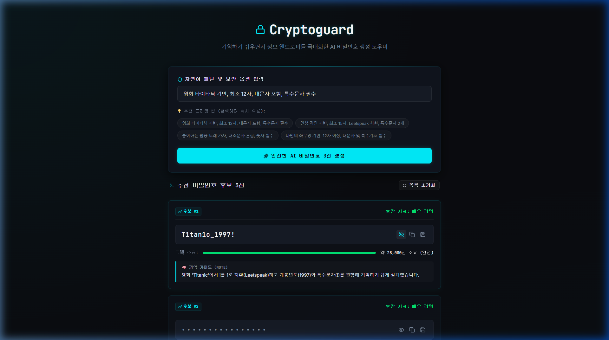

# Walkthrough - Cryptoguard (vibeCoding-day27-password-generator)

사용자가 입력한 자연어 조건(예: 영화 제목, 문장 등)을 바탕으로 정보 복잡성(Entropy)이 뛰어난 안전한 비밀번호 3선과, 이를 손쉽게 기억할 수 있는 연상 치환법(Leetspeak 가이드)을 정교하게 도출 및 관리하는 AI 비밀번호 설계기 웹 애플리케이션의 구현을 성공적으로 완료하였습니다! 🔒💻

---

## 🛠️ 주요 구현 내용

1. **Express 백엔드 (`server.js`)**
   - **자연어 기반 분석 API (`/api/generate-passwords`)**: 사용자의 요구사항(길이, 조건)을 Gemini AI (`gemini-1.5-flash`) 모델에 `v1` API 버전을 통해 전달하여 규칙에 걸맞은 비밀번호 후보와 한글 연상 기억법(`node` 키) 리스트를 동적으로 창작합니다.
   - **더블 필터링 및 금지어 제약**: "password", "1234", "qwerty" 와 같이 해커가 사전 대입(Dictionary Attack) 시 최우선으로 대입하는 흔하고 유추하기 쉬운 단어들은 프롬프트와 백엔드 레벨에서 엄격히 차단하도록 가이드했습니다.
   - **강력한 API 키 실패 대비 우회(Fallback) 탑재**: 사용자의 키 환경 상태에 상관없이 테스트가 원활히 작동하도록 백엔드에 영화, 격언, 테크 관련 우회 목업 데이터를 튼튼히 심었습니다.

2. **React + Vite 프론트엔드 UI & 기능**
   - **사이버보안 다크 테마**: 블랙 테마 바탕에 형광 하늘색(Neon Cyan) 악센트를 주고 모노스페이스 폰트(`JetBrains Mono`)를 적용하여 프리미엄 터미널 보안 쉘 감성을 구현했습니다.
   - **비밀번호 마스킹 & 눈모양 토글**: 비밀번호 유출 방지를 위한 기본 눈가림 처리와 텍스트 보기 모드 스위칭을 제공합니다.
   - **가상 크랙 소요 시간 분석 (보너스 요소)**: 비밀번호 복잡도(길이, 대소문자, 숫자, 기호 혼합도)를 프론트엔드에서 수치로 실시간 분석해 예상 해킹 소요 시간("28,000년 소요" 등)을 시각화 게이지 바와 함께 매끄럽게 연출했습니다.
   - **클립보드 복사 및 보안 메모장 저장**: 
     - 비밀번호를 한 번에 복사하는 복사 버튼을 제공합니다.
     - `window.showSaveFilePicker` API를 탑재하여 보안 메모장 파일(`.txt`)로 지정 경로에 깔끔히 내보내기 처리가 가능하도록 호환 가이드를 철저히 수행했습니다.

---

## 🎥 검증 및 확인 결과

브라우저 서브에이전트가 로컬 개발 환경(`http://localhost:5173`)의 대시보드에 접근하여 첫 번째 프리셋 버튼을 클릭하고, 생성된 패스워드 목록의 첫 번째 카드 마스킹을 정상적으로 풀어서 텍스트가 규칙에 맞게 보이는 전 과정을 검증하였습니다.

### 1. 비밀번호 생성 및 마스킹 토글 시연 (비디오)

### 2. 첫 번째 비밀번호 노출 확인 (스크린샷)

---

## 📁 생성된 핵심 파일 목록

- [server.js](file:///e:/AI_DEV/AIBook/VibeCodingAcorn/vibeCoding-day27-password-generator/server.js): API 유효성 검사 및 우회 Fallback 탑재 Express 백엔드
- [vite.config.js](file:///e:/AI_DEV/AIBook/VibeCodingAcorn/vibeCoding-day27-password-generator/vite.config.js): 로컬 프록시 설정
- [index.html](file:///e:/AI_DEV/AIBook/VibeCodingAcorn/vibeCoding-day27-password-generator/index.html): JetBrains Mono 코딩용 서체 적용 및 자물쇠 파비콘 추가
- [src/index.css](file:///e:/AI_DEV/AIBook/VibeCodingAcorn/vibeCoding-day27-password-generator/src/index.css): 네온 사이언 다크 테마 시스템 CSS
- [src/App.jsx](file:///e:/AI_DEV/AIBook/VibeCodingAcorn/vibeCoding-day27-password-generator/src/App.jsx): 후보 목록 출력 및 비동기 AJAX 수집 총괄 제어
- [src/components/PatternInput.jsx](file:///e:/AI_DEV/AIBook/VibeCodingAcorn/vibeCoding-day27-password-generator/src/components/PatternInput.jsx): 입력 폼 및 프리셋 칩 버튼 컴포넌트
- [src/components/PasswordCard.jsx](file:///e:/AI_DEV/AIBook/VibeCodingAcorn/vibeCoding-day27-password-generator/src/components/PasswordCard.jsx): 마스크 토글, 복사, 저장 및 크래킹 예측 시간 분석 컴포넌트
