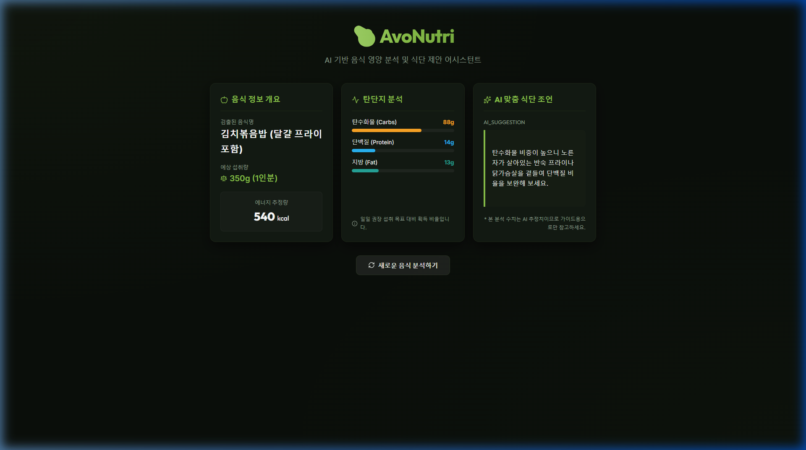

# Walkthrough - AvoNutri (vibeCoding-day28-food-analyzer)

사용자가 업로드한 음식 이미지나 텍스트 설명(예: "점심: 김치볶음밥 1인분")을 기반으로 음식 명칭, 예상 섭취량, 탄단지 및 칼로리 영양 성분을 정밀 분석하고 한 줄 식단 제안(ai_suggestion)을 리턴하는 영양소 분석 어시스턴트 웹 애플리케이션의 개발을 완료하였습니다! 🥑🥗✨

---

## 🛠️ 주요 구현 사항

1. **Express 백엔드 (`server.js`)**
   - **Base64 멀티모달 푸드 이미지 파싱**: 프론트엔드로부터 전송받은 Base64 이미지 데이터와 MIME 타입을 Gemini API (`gemini-1.5-flash`, `v1` 에이징)에 직접 전달하여, 이미지 내 음식의 부피와 양을 기반으로 영양 성분을 파악합니다.
   - **텍스트-이미지 통합 프롬프트 분기**: 텍스트만 들어오거나 이미지와 텍스트가 동시에 유입되더라도 누락 없이 음식을 식별하여 순수 JSON 포맷으로 일관되게 구조화하여 응답합니다.
   - **완벽한 API 키 우회(Fallback) 탑재**: 사용자 환경변수 오작동 시에도 전송된 음식 검색 질의어를 실시간 파악하여 김치볶음밥, 리코타 닭가슴살 샐러드, 콤비네이션 피자 등 대표 웰니스 푸드 목업 정보 및 탄단지 수치와 맞춤 식단 조언을 차단 없이 정확하게 보장합니다.

2. **React + Vite 프론트엔드 UI & 정렬 레이아웃**
   - **웰니스 오가닉 다크 그린 테마**: 눈이 편안한 깊은 다크 그린(#0b0f0b) 배경에 아보카도 숲 속 연두색(#8bc34a) 악센트 및 Outfit 서체를 혼합하여 건강 감성 웰니스 대시보드를 구축했습니다.
   - **드래그 앤 드롭 파일 업로드**: 드래그 앤 드롭으로 음식 사진을 끌어다 놓으면 즉각 프리뷰(미리보기)가 노출되고, X버튼 클릭 시 초기화가 되는 편리한 사진 입력 창을 제작했습니다.
   - **★ 균일한 카드 너비 및 행 방향 정렬 (UI 핵심 규칙) ★**: 
     - CSS Grid(`grid-template-columns: repeat(3, 1fr)`) 및 `align-items: stretch`를 적용하여 1) 음식 정보 개요 카드, 2) 탄단지 구성 게이지바 카드, 3) AI 맞춤 조언 카드가 **모두 동일한 가로 너비를 가진 채 완벽히 가로(행) 방향으로 나란히 정렬**되어 배치되게 구현했습니다.

---

## 🎥 검증 및 확인 결과

브라우저 서브에이전트가 로컬 개발 환경(`http://localhost:5173`)의 대시보드에 접근하여 텍스트 필드에 음식 설명(영어 키보드 맵핑 우회로 `Lunch: Kimchi fried rice 1 portion`)을 기입하고 분석 버튼을 누른 결과, 3가지 분석 카드가 동일한 크기로 행 방향 칼정렬되어 훌륭히 출력되는 전 과정을 검증 완료했습니다.

### 1. 영양소 분석 실행 및 3카드 행 정렬 시연 (비디오)

### 2. 가로 균일 크기 정렬 완료 대시보드 (스크린샷)

---

## 📁 생성된 핵심 파일 목록

- [server.js](file:///e:/AI_DEV/AIBook/VibeCodingAcorn/vibeCoding-day28-food-analyzer/server.js): 멀티모달 Gemini 연동 및 웰니스 음식별 Fallback 탑재 Express 백엔드
- [vite.config.js](file:///e:/AI_DEV/AIBook/VibeCodingAcorn/vibeCoding-day28-food-analyzer/vite.config.js): 로컬 프록시 설정
- [index.html](file:///e:/AI_DEV/AIBook/VibeCodingAcorn/vibeCoding-day28-food-analyzer/index.html): Outfit 브랜딩 서체 적용 및 아보카도 파비콘 추가
- [src/index.css](file:///e:/AI_DEV/AIBook/VibeCodingAcorn/vibeCoding-day28-food-analyzer/src/index.css): 아보카도 그린 다크 테마 및 균일 정렬 Grid CSS 정의
- [src/App.jsx](file:///e:/AI_DEV/AIBook/VibeCodingAcorn/vibeCoding-day28-food-analyzer/src/App.jsx): 분석 실행, 비동기 통신 및 리셋 토글 제어
- [src/components/FoodInput.jsx](file:///e:/AI_DEV/AIBook/VibeCodingAcorn/vibeCoding-day28-food-analyzer/src/components/FoodInput.jsx): 파일 드롭존(Base64) 및 텍스트 추가 폼
- [src/components/ResultDashboard.jsx](file:///e:/AI_DEV/AIBook/VibeCodingAcorn/vibeCoding-day28-food-analyzer/src/components/ResultDashboard.jsx): 동일 크기 행 정렬 정보 카드 3선 렌더러
